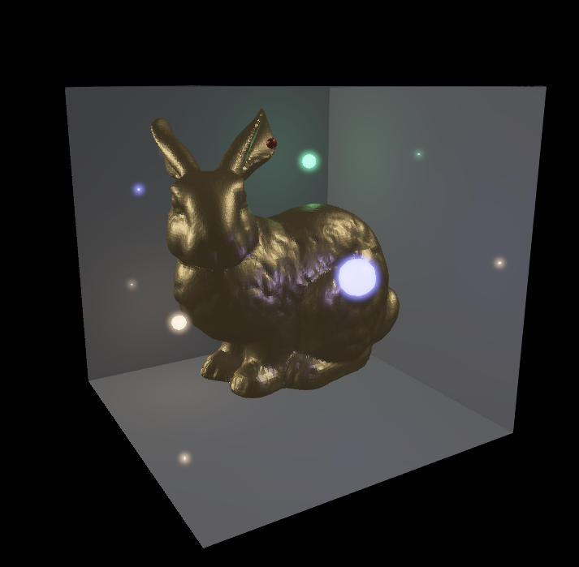

# 3D Rendering Demo
Demo of various advanced 3D rendering techniques, implemented with SDL2 and OpenGL 



Many of these techniques are based on the Advanced Lighting tutorials found here: https://learnopengl.com/

TODO
- [X] Antialiasing
  - [X] MSAA (Directly supported by OpenGL)
  - [X] MSAA for secondary framebuffers with texture attachments
  - [ ] FXAA (or SMAA) (as MSAA is not (performantly) compatible with Deferred Shading)
- [X] Basic Lighting
  - [X] Point Lights
  - [X] Directional Lights
- [ ] Advanced Lighting
  - [X] Blinn-Phong Shading
  - [X] Gamma Correction
  - [X] Emissive Lighting
  - [X] HDR
  - [X] Bloom
  - [X] Deferred Shading
  - [X] SSAO

  - [ ] Image-Based Ambient Lighting
      - [ ] Diffuse Irradiance
      - [ ] Specular
- [ ] Shadow Mapping


# Requirements
- CMake (minimum version 3.5): https://cmake.org/install/
- SDL2: https://www.libsdl.org/download-2.0.php
- glew: http://glew.sourceforge.net/

# How to build and run
On linux (not yet tested on macOS), 
```
git clone git@github.com:mfirmin/model-viewer.git
cd model-viewer
mkdir build
cd build
ln -s ../assets .
cmake ..
make
./modelviewer
```

# Usage

- `A`: Toggle AntiAliasing (default on)
- `L`: Toggle Primary Lighting (default off)
- `1-4`: Toggle Scene Lights (default on)
- `S`: Toggle Blinn-Phong shading on/off (default on)
- `H`: Toggle HDR (default on)
- `G`: Toggle Gamma Correction (default on)
- `I`: Cycle through different intensities (1, 2, 4, 8, 16) for light 1 (useful for seeing the effects of HDR)
- `B`: Toggle Bloom on/off (default on)
- `O`: Toggle SSAO on/off (default on) (enable primary lighting to see effects)
